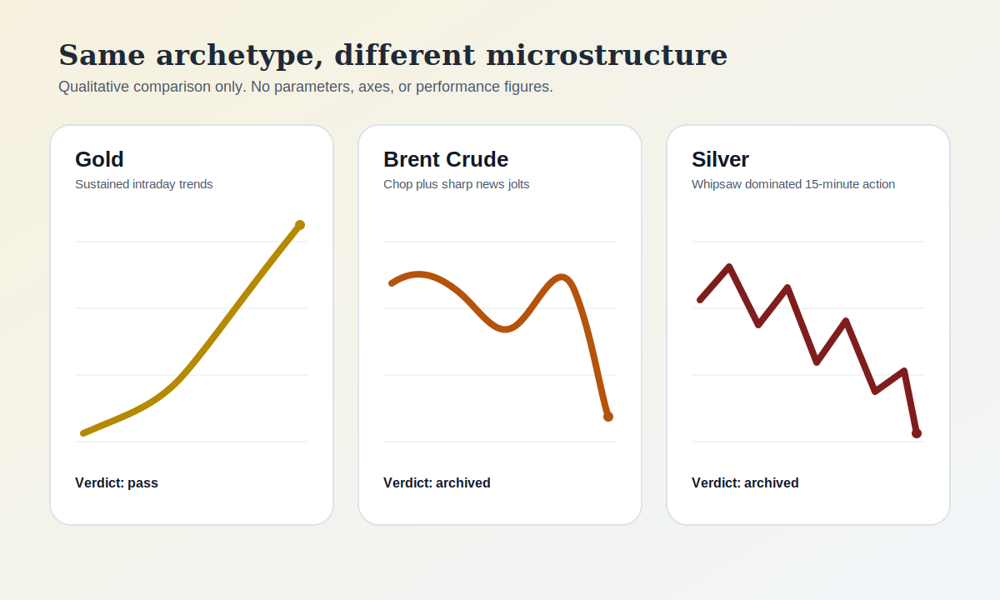

The easiest mistake in strategy research is not building a bad idea.

It is assuming that a good idea has more cousins than it really does.

That was the temptation after one of our Gold momentum research lines worked. Gold had earned its way through the research path strongly enough to raise the obvious next question: if the archetype works there, does it also work on nearby commodity markets like Brent crude and Silver?

That is a reasonable question.

It is also exactly the kind of question that can get a research team into trouble if it is answered by intuition instead of evidence.

So we ran the next step properly.

On April 15, 2026, we picked up the follow-on research. Brent had enough history to backfill and test quickly. Silver needed a fresh data fetch first. Within a little over an hour, both paths had produced the answer. Brent failed first. Silver followed. By 05:18 UTC, both instruments were archived.

## Research sequence

- `2026-04-11`: the earlier Gold result raised the obvious next question: does the same momentum archetype extend to nearby commodities?
- `2026-04-15 04:04 UTC`: the follow-on research opened, with Brent ready for a fast backfill and Silver needing a fresh fetch first.
- `2026-04-15 04:10 UTC`: Brent was already showing the wrong kind of structure for the idea and was recorded as a fail.
- `2026-04-15 05:18 UTC`: Silver followed, and both non-Gold paths were archived.

That may sound like a disappointing outcome.

It was actually a useful one.

The failed generalisation told us something more valuable than "commodities are similar" ever could.

It told us that intraday microstructure fit matters more than family resemblance.

In plain English: markets can share a label and still behave very differently once you look at how they move bar by bar.

Gold gave this momentum archetype the thing it needed most: sustained intraday trends. Brent did not. Its price action spent too much time in range-bound chop, and when it moved decisively it was often around sharp news-driven bursts rather than the kind of movement that lets a short-horizon trend strategy stay aligned. Silver was worse. On a 15-minute view it was dominated by whipsaw, which is another way of saying the market kept faking direction changes fast enough to punish a system that needs cleaner continuation.

Same broad asset bucket.

Different rhythm.

That is the real story here.

The lesson is not that momentum "stopped working" outside Gold. The lesson is that an archetype that fits one instrument's intraday structure does not automatically fit its neighbours, even when the neighbours look close enough to tempt you into assuming they should.

That changed our process in a specific way.

We now treat microstructure fit as a first-class screening question before we clone a winning strategy onto an adjacent market. Instrument category alone is not a green light. "Commodity" is not a trading behaviour. The path from a promising idea to a deployable sleeve still runs through the same hard question: does this market move in a way that gives the archetype what it needs?

In this case, Gold did.

Brent and Silver did not.

That negative result saved us from a worse mistake later. It is much cheaper to archive an idea during research than to smuggle it into a live basket on the strength of a story about how it ought to work.

This is also why we think failed extensions deserve to be written up in public when they can be shared safely. Success stories are useful. Honest non-generalisations are often more useful, because they show where the boundary really is.

The earlier Gold result mattered.

The follow-on Brent and Silver result clarified why it mattered: not because we had found a commodity template, but because we had found a fit between one archetype and one market's intraday behaviour.

That is a narrower lesson than "momentum works on commodities."

It is also a truer one.

## Qualitative comparison

| Instrument | EMA momentum verdict | Headline issue |
| --- | --- | --- |
| Gold (XAU/USD) | Pass - already in the live basket | sustained intraday trends, archetype fit |
| Brent Crude | Fail - archived | range-bound chop and news spikes break the signal |
| Silver (XAG/USD) | Fail - archived (worst of the three) | 15-minute price action dominated by whipsaw |

## What changed for us

- We now treat microstructure fit as a first-class screening question before cloning a winning strategy onto an adjacent instrument.
- Gold remains, for now, our only viable commodity-momentum instrument.
- If we pursue more commodity diversification later, it is more likely to come from different archetypes or longer timeframes than from more short-horizon EMA-momentum clones.
