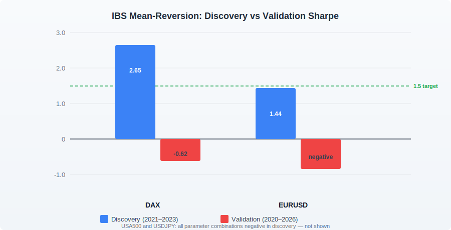

We have a rule in our research process.

Every strategy has to survive a validation window that it never saw during parameter optimisation. This is standard practice in systematic trading research. The logic is simple: discovery fits, validation proves. Until a strategy survives both, it has not proven anything.

The Internal Bar Strength strategy — IBS for short — had the strongest edge rationale of anything we tested during our Phase 3 research. It produced the best discovery results on our primary test instrument. Then validation touched it, and the results evaporated.

That is a useful story, and it is worth telling honestly.

## What is IBS?

The formula is simple:

```
IBS = (close − low) / (high − low)
```

A reading near zero means the bar closed very close to its session low. A reading near one means it closed near its high. Academic work going back years points to a consistent pattern: extreme IBS readings on intraday and daily bars tend to mean-revert in the subsequent session. A bar that closes near its absolute low tends, on average, to be followed by a higher bar.

Our research pipeline identified IBS as the strongest candidate in a batch of new archetypes, with an estimated spread buffer of 10 to 15 times the typical bid/ask cost. Most strategies we consider viable need a buffer of around two to three times. A 10-to-1 buffer sounds almost unreasonably comfortable.

We should have been more suspicious of that number.

## How we built and tested it

To avoid acting on a raw single-indicator signal, we required three conditions to align before entering a trade. On the long side: the hourly RSI had to be below 35 (oversold context), price had to be below the lower Bollinger Band on a 15-minute bar (2.5 standard deviations), and the 15-minute IBS had to be below 0.15, meaning the bar closed near its session low. The short side mirrored these conditions exactly.

Exits were built to be similarly conservative: a return to the Bollinger middle band, an IBS cross of 0.5, a 3-ATR stop loss, an 8-bar time stop, or the mandatory session close. We added an ADX regime filter to avoid trading into strongly trending conditions, where mean-reversion logic tends to fail.

We ran 144 parameter combinations across four instruments: DAX, EURUSD, USDJPY, and USA500.

## Discovery looked like a success

On DAX during the 2021–2023 discovery window, the best parameter combination returned a Sharpe ratio of 2.65. Profit factor 1.57. Win rate 55%. 134 round trips — enough to draw a meaningful statistical picture. A second configuration returned 2.40. A third, 1.73. Three distinct parameter sets passed our acceptance threshold of Sharpe > 1.5 on the same instrument.

EURUSD showed a best discovery Sharpe of 1.44 with a 60% win rate. Slightly below our 1.5 target, but directionally interesting.

USA500 and USDJPY were negative across all combinations even in discovery — an early and useful warning that the edge was not broad. But DAX was hard to dismiss.

The numbers asked to be taken seriously.

## Validation erased them

Our validation window runs from 2020 to 2026 — a period that includes the COVID crash of 2020, the sustained 2022 bear market, the 2023 recovery, and 2024 and 2025 in full. It is a materially different collection of market regimes from the 2021–2023 discovery window.

The results:

| Instrument | Discovery Sharpe | Validation Sharpe |
| :--- | ---: | ---: |
| DAX (best config) | 2.65 | **-0.62** |
| DAX (2nd config) | 2.40 | **-1.03** |
| EURUSD (best config) | 1.44 | **negative** |
| USA500 | -1.45 | not tested |
| USDJPY | -1.52 | not tested |

No parameter combination passed the validation window on any instrument.



## Why this happens

The 2021–2023 discovery window coincided with a period when DAX exhibited a specific pattern: moderate intraday momentum followed by reliable end-of-session mean reversion. The IBS strategy found that pattern. It fit it precisely. Parameter optimisation selected settings that were tuned to that particular regime.

When the validation window extended into 2020 (COVID volatility), 2022 (sustained directional selldown), and 2024–2025 (strong equity recovery), those years did not exhibit the same reversal structure. The strategy's three-gate filter — which looked rigorous on paper — was ultimately selecting for conditions specific enough to be real in some regimes and completely absent in others.

The 10-to-1 spread buffer argument came from academic literature that measured the average IBS effect across diverse instruments and long time windows. In practice we were not trading the average. We were trading specific instruments in specific windows, and the average does not transfer cleanly to any of them.

This is a different lesson from "the strategy did not work." The lesson is more specific: a strong academic edge rationale and compelling discovery numbers can co-exist with zero validation alpha. When they do, the academic rationale does not rescue you. Validation is the only gate that matters.

We archived the IBS strategy.

We kept the lesson.
