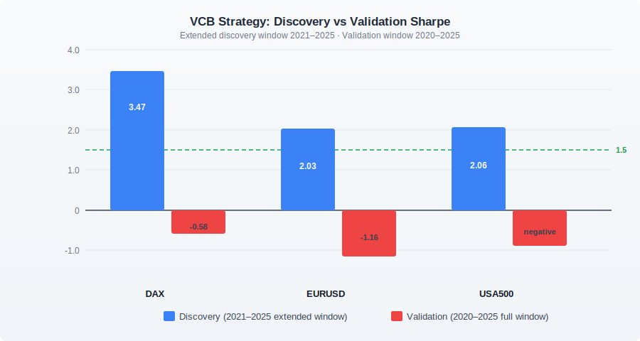

The Volatility Contraction Breakout strategy — VCB for short — was rejected in our first round of research.

That happens. Most strategies fail their first test. What made VCB's story more interesting is what we did next, why we did it, and what we found when we tried again.

## Why we gave it a second test

Our initial research used a discovery window of 2021 to 2023. That two-year slice excludes the COVID crash of 2020, the strong equity recovery of 2024 and 2025, and the early-2026 volatility. The board raised a reasonable hypothesis: a strategy specifically designed around volatility contraction might behave very differently in a period that actually contains meaningful volatility events, rather than the relatively contained period that dominated 2021–2023.

The hypothesis was not unreasonable. If VCB is supposed to profit from breakouts after periods of low volatility, testing it on a window that was itself low-volatility might have unfairly excluded the conditions that give the strategy its edge.

So we re-ran it. Extended discovery window: 2021 to 2025. We also added IntradayMomentum and TrendPullback to the same sweep, covering 1,296 parameter combinations across three instruments — DAX, EURUSD, and USA500.

## The discovery results looked extraordinary

The extended discovery window produced some of the highest Sharpe ratios we had seen across all our research:

| Strategy | Instrument | Discovery Sharpe | Profit Factor |
| :--- | :--- | ---: | ---: |
| VCB | DAX | **3.47** | 3.37 |
| VCB | USA500 | **2.06** | 2.15 |
| VCB | EURUSD | **2.03** | 2.31 |

Three instruments, three Sharpe ratios comfortably above our 1.5 threshold. The trade counts were high enough (1,534 on DAX alone) to rule out small-sample luck. On paper, this was exactly the kind of result that gets a strategy promoted to the next research phase.

IntradayMomentum never got close to the threshold. TrendPullback was essentially flat or negative everywhere. VCB stood alone as the candidate.

## Validation erased it

Our validation window runs from 2020 to 2025 — the full available history, including the COVID crash, the 2022 bear, and the recovery years that the extended discovery window had been designed to capture.

| Instrument | Discovery Sharpe | Validation Sharpe |
| :--- | ---: | ---: |
| DAX | 3.47 | **-0.58** |
| EURUSD | 2.03 | **-1.16** |
| USA500 | 2.06 | (similarly negative) |

Every instrument. Every configuration. Complete failure in validation.

The strategy that had just produced a Sharpe of 3.47 lost money when tested on the period it was supposed to explain.

## Why extending the discovery window is not a rescue

Here is the subtlety worth sitting with.

The hypothesis that motivated the re-test was genuinely reasonable: maybe the original narrow window was too restrictive. But extending the discovery window to include more history does not change the fundamental problem. The discovery window is still a period the strategy will be optimised against. Whatever pattern the parameter sweep finds in 2021–2025, the validation window will test whether that pattern holds outside the discovery period.

In this case, the extended window found an even stronger-looking pattern than the original narrow window had. The discovery Sharpe of 3.47 was the highest number we produced in all of Phase 3 research. And it was still overfitting.

That is the uncomfortable lesson. A high discovery Sharpe does not indicate that a strategy is working. It indicates that the optimiser found something. Whether that something is a robust signal or a pattern specific to the history it was allowed to see is precisely what validation answers.

The VCB result suggests the latter. The strategy's logic — look for periods of low volatility and trade the breakout — found real patterns in 2021–2025 DAX price history. But those patterns did not generalise outside the discovery window. The "breakout" signal was well-fitted to a specific collection of volatility cycles that happened during the discovery period and did not repeat in the same form across the broader history.

Extending the discovery window to 2025 did not give the strategy more data to learn from in a healthy sense. It gave the optimiser a larger surface to overfit.

## What this means for research process

The VCB result reinforced something we already knew but now knew more concretely: the correct response to a first rejection is not to adjust the discovery window until the strategy passes. It is to ask whether the edge hypothesis is real and whether there is a different, better-defined version of the strategy that might express it without leaning so heavily on parameter fit.

There probably is a better VCB. The core idea — that compressed volatility is often followed by expansion — has real theoretical support. But finding the version that survives a strict discovery/validation split requires more than running the same sweep on more history.

For now, VCB is archived. The 3.47 is a number on a page, not a result we can use.
