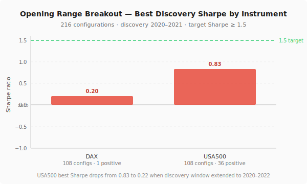

Every researcher who works with short-term strategies eventually tests an Opening Range Breakout.

The idea is simple and old: in the first minutes of a trading session, large orders hit the market as participants react to overnight news, pre-session positioning, and opening auctions. That order flow creates an imbalance that pushes price in one direction. If the direction holds, a breakout above or below the session's initial range becomes a reliable signal of where the session is going.

It is a well-documented strategy. The academic literature goes back decades. Practitioners have written about it in detail. In at least some implementations, at least in some periods, it appears to work.

We could not make it work.

## How the test was designed

The strategy logic followed the standard specification. For each session:

1. Identify the opening range — the high and low formed during the first N minutes (15, 30, or 45 minutes in the sweep)
2. Wait for a bar close above the range high (breakout long) or below the range low (breakout short)
3. Apply a directional filter: only take long signals on sessions where the first bar closed above its open, and short signals on sessions where it closed below — the idea being to trade with early momentum rather than against it
4. Require an activity confirmation: either volume above the 20-bar average, or the range width above a threshold, to avoid entering on quiet drifts
5. Set a stop loss proportional to the opening range width and a take-profit at a fixed multiple

Two instruments: DAX and USA500. Three opening range durations: 15, 30, and 45 minutes. Four activity filter modes. Three TP/SL ratio settings. Four time-stop durations. That is 108 configurations per instrument — 216 in total.

The discovery window covered 2020 to 2021. Validation was 2022 onwards.

## What the sweep found

Zero configurations met the deployment threshold on either instrument.

| Instrument | Configurations | Best Sharpe | Mean Sharpe | Configs with Sharpe > 0 |
| :--- | ---: | ---: | ---: | ---: |
| DAX | 108 | 0.20 | -0.88 | 1 of 108 |
| USA500 | 108 | 0.83 | -0.68 | 36 of 108 |
| **All** | **216** | **0.83** | **-0.78** | **37 of 216** |

The USA500 result of 0.83 is the closest any configuration came to the 1.5 threshold — and it still failed by nearly half.

But the Sharpe number understates how far the best result was from deployment. The same USA500 configuration had a maximum drawdown of 62% relative to total profit. Our threshold is under 15%. In practice, the "best" configuration was delivering enough gross return that the Sharpe looked marginal but taking it back through drawdown to a level that would make the strategy unusable in practice.

When the discovery window was extended from 2020–2021 to 2020–2022 to check stability, the USA500 best Sharpe dropped from 0.83 to 0.22. The 15MIN ORB edge, already thin, was sensitive enough to the exact window that a single additional year reduced it by nearly 75%.

No configurations were advanced to the validation phase. None survived the discovery filter.

## Why the strategy failed at 15-minute bars

The core finding was structural rather than parametric.

**DAX was unambiguously non-viable.** One of 108 configurations produced a positive Sharpe. The round-trip spread on DAX at 15-minute bars absorbed everything the breakout produced. The session open on DAX involves significant early volatility around the Xetra open at 08:00 UTC (summer) or 09:00 UTC (winter), and the 15-minute range captures most of that move. By the time a 15-minute bar closes and a signal fires, the majority of the breakout has already occurred. The strategy was entering the tail of the move.

**USA500 showed marginal edge at one combination** — 15-minute opening range, tight TP, both activity filters active, 3-hour time stop — but failed on drawdown and showed sensitivity to the discovery window. The pattern that produced 0.83 in 2020–2021 was not present in 2022.

The structural issue is granularity. Opening range breakout strategies in the literature that show strong results typically use 5-minute bars, not 15-minute bars. At 15-minute resolution, the opening range itself is large relative to the expected continuation move, and many genuine breakouts have already partially resolved within the 15-minute bar that identifies them. The strategy is late by design.

This is not a parameter problem. It is not something that a different TP ratio or a tighter regime filter can fix. The signal the strategy is designed to capture happens at a resolution finer than 15-minute bars allow.

## The directional filter and activity confirmation did not help

One reasonable expectation going in was that the filters would prove their value — that the strategy might struggle without them and succeed with them. The result was simpler: the filters had no discriminating power at this granularity.

Win rates across all configurations settled around 45–50%. The activity filters did not systematically identify higher-quality setups. The directional filter did not reduce false breakouts. At 15-minute resolution, whatever signal the opening range carries has already been diluted to the point where no combination of gates recovers it.

## What happens at finer granularity

We did not test at 5-minute bars as part of this sweep. The backtest framework supports any granularity built from 1-minute base candles, and the natural follow-up question after seeing these results was whether the strategy performs at the granularity where the literature claims it should.

That is a reasonable test to run. It is not a test that changes the conclusion about 15-minute bars. A strategy that fails to produce edge at one granularity is not rescued by evidence that edge exists at a different granularity — those are separate research questions.

The ORB at 15-minute bars was archived. The question of whether a 5-minute ORB is worth testing remains open.
