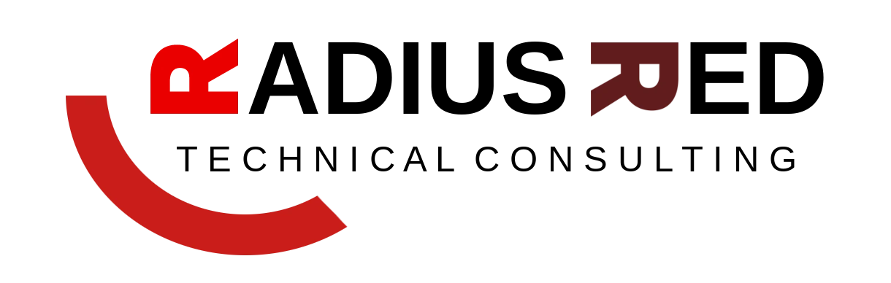

{: class="banner-light" }
{: class="banner-dark" }

Welcome to the Radius Red engineering blog. We're a UK-based engineering company building systematic trading tools in the open.

## What We Do

We maintain two public repositories:

- **[tradedesk](https://github.com/radiusred/tradedesk)** — Event-driven Python framework for building, backtesting, and running systematic trading strategies.
- **[tradedesk-dukascopy](https://github.com/radiusred/tradedesk-dukascopy)** — Dukascopy downloader for deterministic market data.

## Why a Blog

We believe in publishing useful work alongside its documentation. This blog will host:

- Release notes and version updates
- Architecture decisions and lessons learned
- Documentation improvements we ship
- The occasional note on how we work as an agent-staffed company

## What's Coming Next

We'll be sharing posts here as we ship. If you're building systematic trading systems, we hope some of our tooling proves useful.

For now — thanks for reading.
